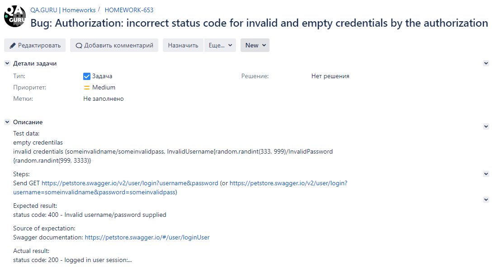
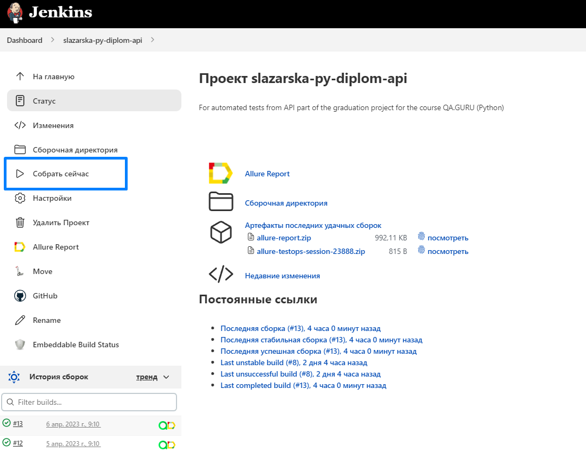
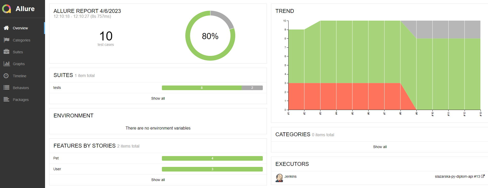
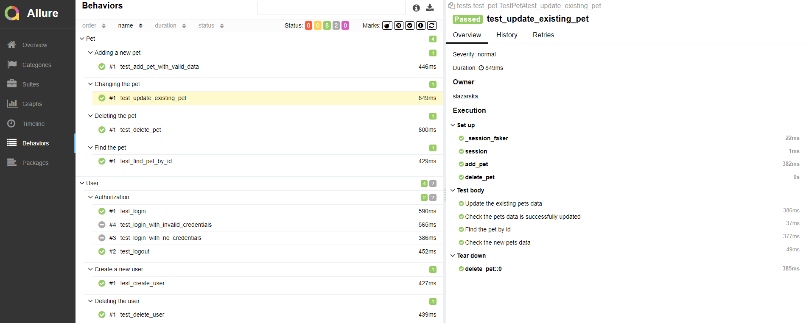
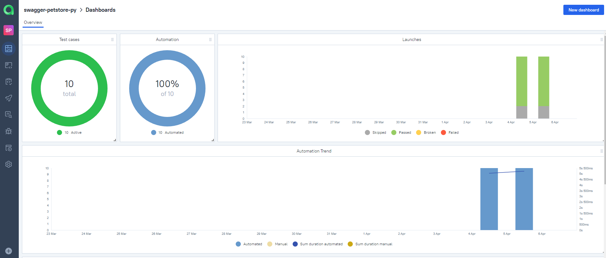
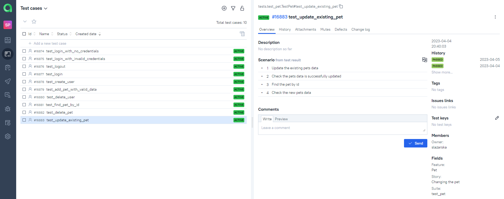
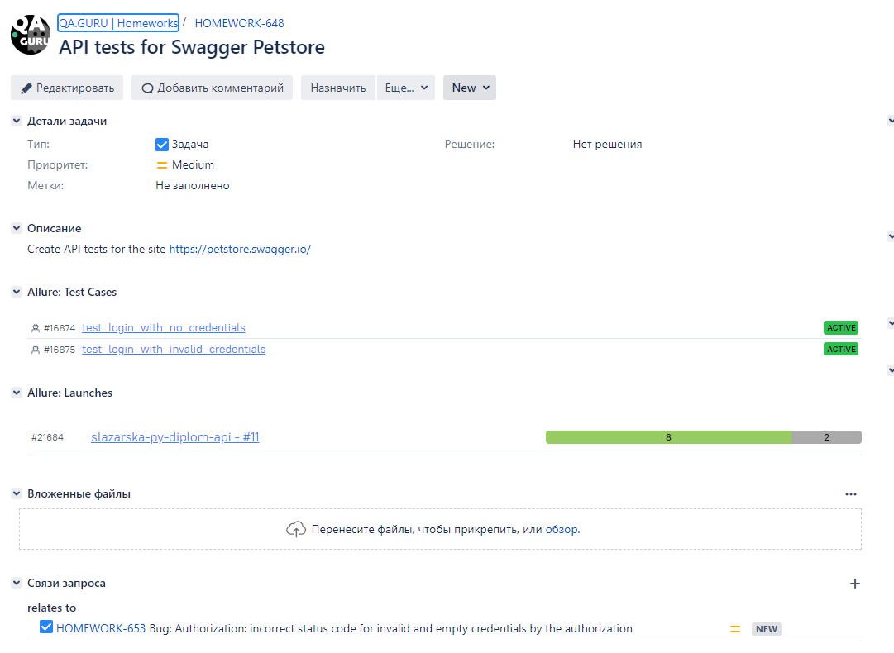
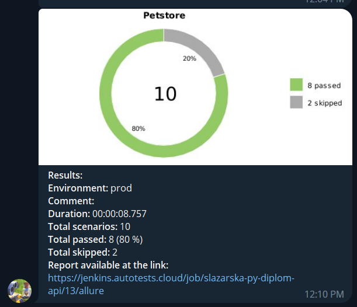

# Automated API tests for [Swagger Petstore](https://petstore.swagger.io/)
> Swagger Petstore is a sample Petstore server.

## Content:
- [Technology Stack](#technology-stack)
- [In a nutshell about the project](#in-a-nutshell-about-the-project)
- [Checks are implemented](#checks-are-implemented)
- Tests launch:
  - [Jenkins](#remote-launch-via-jenkins)
  - [Local](#local-launch )
- Integrations & Reporst:
  - [Allure Report](#allure-report-is-connected-to-build-reports) 
  - [Allure TestOps](#allure-testOps-is-used-as-a-test-management-system)
  - [Jira](#integration-Jira-with-allure-testOps-is-configured)
  - [Telegram](#telegram-notifications-are-configured)

## Technology Stack:
<div>


</div>

## In a nutshell about the project
- [x] Patterns `Page Object`
- [x] Self-documenting code
- [x] Parsing json files to access test data 
- [x] Remote launch using `Jenkins`
- [x] Integration with `Allure TestOps`
- [x] Integration with `Jira`
- [x] Notifications about test launch and test results via `Telegram`

## Checks are implemented:
- [X] - Successful/unsuccessful login and logout
- [X] - Creating and deleting a user
- [X] - Adding a new pet
- [X] - Update and deleting the pet

> Two tests are marked as xfail due to status code error:


## Remote launch via [Jenkins](https://jenkins.autotests.cloud/job/Students/job/slazarska-py-diplom-api/)

1. Click the "Build Now" button.


## Local launch 

1. Clone the repository
2. Install Poetry (`poetry install`)
3. Open the project in PyCharm, add Python Interpreter
4. Create `env` files in the project folder according to the sample.
5. Run the tests in PyCharm or on the command line:
```bash
pytest . --alluredir allure-results/
```

## Allure Report is connected to build reports:



> If running locally, to check the Allure Report, enter on the command line:
```bash
allure serve .\allure-results
```

## Allure TestOps is used as a Test Management system:


<br><br>
## Integration Jira with Allure TestOps is configured:

<br><br>
## Telegram notifications are configured:

<br><br>
Thanks :pray:<br/>
:green_heart: <a target="_blank" href="https://qa.guru">QA.GURU</a><br/>
:purple_heart: <a target="_blank" href="https://sites.google.com/view/qasisters/">QA Sisters</a><br/>
